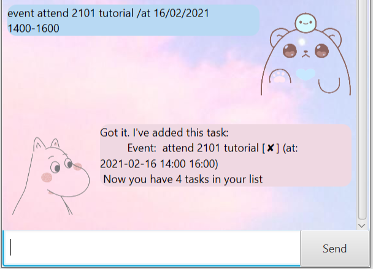

# User Guide

Duke is the go-to chat-bot which helps to manage and organize your task efficiently. Implemented with different avatars and a simple user interface, you will be able to nagivate through it without fuss.

## Table Of Content

* [Quick Start](#quick-start)
* [Features](#features)
	1. Add a task 
		* To-dos
		* Deadlines
		* Events
	2. List all tasks
	3. Delete a task
	4. Mark Task as done
	5. Find a task
	5. Exit Program
* [Command Summary](#command-summary)

# Quick start

1. Ensure you have Java `11` or above installed in your Computer.

2. Download the latest `duke.jar` from [here](https://github.com/SiTingST/ip/releases/tag/A-Release).

3. Double-click on the downloaded file to launch Duke. 
	** A data folder will be created in the folder containing duke.jar file. Duke save your task in the data file for efficient retrieval of task. 
	
4. After starting the application, you should see the GUI as shown below:

## Features

### Add a task :  `todo`, `deadline`, `event`

There are three different tasks, namely, todo, event and deadline. 
  There are different commands used to facilitate the adding of different tasks to the program as seen below.

Notes:
* Commands are case-insensitive. The program only takes in command in lower alphabets. 
* Users should add ONE task at a time. 

#### `todo`
Todo command add a todo task which requires task description and no other field as input.

Format: `todo` description

Examples:
* `todo CNY visiting`
* `todo ST2334 tutorial`

#### `deadline`
Deadline command add a deadline task which requires task description, date and time to specify the due date and time of the task. 

Format: `deadline` description /BY date[DD/MM/YY] time [HHMM]

Note: Do ensure that the time is given in HHMM format with no extra spacing or semicolon 

Deadline command add a deadline task which requires task description, due date and due time of the task. 
Format: `deadline` description /BY date[DD/MM/YY] time [HHMM]`
Examples:
* `deadline submit proposal /by 03/05/2021 1800`

#### `event`
Event command add a event task which requires task description, date as well as start and end time of the task. 

Format: `event` description /AT date[DD/MM/YY] time [HHMM] - time [HHMM]

Note: Do ensure that the time is given in HHMM format with no extra spacing or semicolon 

Event command add a event task which requires task description, date as well as start and end time of the task. 
 Format: `event` description /AT date[DD/MM/YY] time [HHMM] - time [HHMM]`
Examples:
* `event attend internship meeting /at 17/02/2021 1000-1100`

### Listing all tasks : `list`

Shows a list of all the task in duke.

Format: `list`

### Delete a task : `delete`

Delete a task using its task index in list.

Format: `delete task_index`

Assume that we still have 4 task, 
 `delete3`: will remove the third task on the list

### Mark task as done : `done`

Mark the given task as completed which will add a tick beside the task when list command is executed. 

Note: All tasks added are uncompleted by default. 

Format: `done task_index`

Example:

Assume that we still have 3 task, 
  `done 1`: will mark the first task on the list as completed 

### Find a specific task : `find`

Show all tasks that matches or contain keywords. 

Format: `find keywords`

Example:
  `find CS2105`

## Command summary

**Action**  | **Format, Examples**

--------|-----------------
**Add todo** |  `todo description`e.g, `add todo watch netflix `
**Add deadline** | `deadline description, date` e.g, `deadline finish cs2103 quiz 18/02/2021 `
**Add event** | `deadline description, date, start time, end time` e.g, ` event attend internship meeting /at 17/02/2021 1000-1100`
**List** | `list`
**Delete** |`delete INDEX`e.g., `delete 3`
**Find** |  `find KEYWORD [MORE_KEYWORDS]` e.g., `find cs2103 quiz`
**Mark as done** | `done INDEX` e.g., 'done 4'
--------------------------
